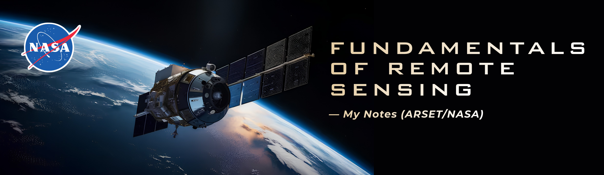

# Fundamentals of Remote Sensing — My Notes (ARSET/NASA)

📚 **Official course:** [Fundamentals of Remote Sensing](https://www.earthdata.nasa.gov/learn/trainings/fundamentals-remote-sensing) — NASA Applied Remote Sensing Training Program (ARSET)
🕐 **Format:** 2-hour self-paced online training, certificate of completion
📅 **Taken:** August 2026

## About this repository

This repository contains my **personal notes, expanded explanations, and additional research** while taking this ARSET course. It does **not** contain any official course material (slides, PDFs, videos, or copyrighted content) — everything here is my own interpretation, summaries, and independent research on the topics covered.

If you want to take the official course, you can register for free through the [ARSET learning management system](https://www.earthdata.nasa.gov/learn/trainings/fundamentals-remote-sensing).

## About the course

> In this self-paced course, you'll learn the underlying science behind how remote sensing works and the basic functional characteristics of satellites and sensors. You will explore the kinds of satellite remote sensing data that are available, advantages and disadvantages of remote sensing, and some basic tools to visualize data. By the end of the course, you'll be equipped to begin your journey using NASA's no-cost, open-access remote sensing data and resources.

Fundamentals of Remote Sensing is often a **prerequisite** for other ARSET trainings, and is aimed at professionals and students with no previous experience in remote sensing.

### Learning objectives (official)

- Explore ways that satellite remote sensing observations are used to study Earth's systems.
- Recognize which properties of Earth's systems can be observed from space.
- Examine how satellite sensors measure electromagnetic radiation to derive geophysical parameters within the Earth-atmosphere system.
- Identify the range of remote sensing data product levels available, illustrated by diverse case study examples.
- Identify basic methods to work with different levels of remotely sensed data.
- Recognize common strengths and weaknesses of using remote sensing for Earth observations.
- Use the NASA Worldview webtool to access and view a remote sensing dataset for a selected region and time frame.

## Repository structure

```
arset-fundamentals-remote-sensing/
├── README.md                              # this file
├── notes/                                 # my notes, module by module
│   ├── 01-what-is-remote-sensing.md
│   ├── 02-electromagnetic-spectrum.md
│   ├── 03-platforms-and-sensors.md
│   ├── 04-spatial-spectral-temporal-resolution.md
│   └── 05-applications.md
├── additional-research/                   # extra research beyond the course
│   ├── satellites-mentioned.md            # my own fact sheets on satellites/sensors mentioned in the course
│   └── glossary.md                        # technical terms explained in my own words
├── project/                               # practical exercise / hands-on work (e.g. NASA Worldview)
│   ├── README.md
│   └── ...
├── resources/                             # extra material: banner image + useful external links
│   ├── banner.png
│   └── resources.md
└── LICENSE
```

## What I learned (summary)

*(to be filled in as I progress through the course)*

## Recommendations for anyone taking this course

*(to be filled in — tips, what was hard, what I'd do differently)*

## Resources that helped me

See [`resources/resources.md`](./resources/resources.md) for the full list.

## Citation

> ARSET - Fundamentals of Remote Sensing. NASA Applied Remote Sensing Training Program (ARSET). https://www.earthdata.nasa.gov/learn/trainings/fundamentals-remote-sensing

## License

The content of this repository (notes, research, and projects) is my own work, licensed under [MIT](./LICENSE) unless noted otherwise. The ARSET course itself and its official materials belong to NASA/ARSET and are **not** included here — only referenced.